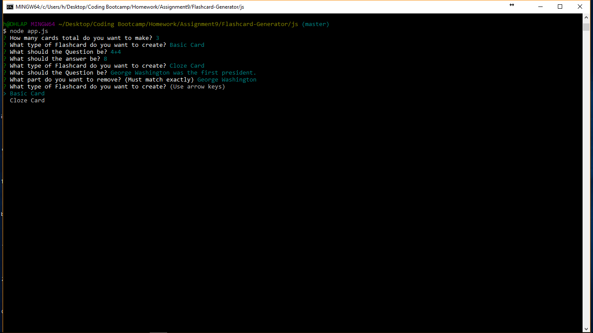
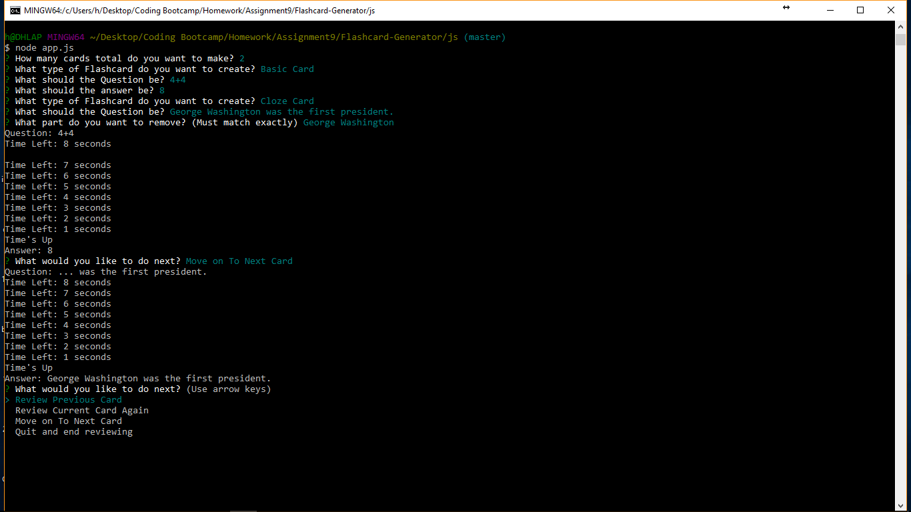

# Flashcard-Generator

This is a node based app that uses inquirer interface in the terminal to allow users to create flash cards for temporary review. It is designed for one time use and does not persist data.

## Creating Cards

There are two types of cards that can be created, a basic card and a cloze card.  A basic card allows for more freedom in that the front of card and back of card is completely unhindered by whatever the user wants to enter.  A cloze card is like a fill in the blank card. This card has the full answer on the front of the card and then the back of the card is the exact phrase you want removed from the answer.  You do have to let the application know up front the amount of cards that you would like to create.  

## Reviewing Cards

Once the user has completed the amount of cards they indicated they would create, the application goes forward into review mode.  Immediately the first card front is shown.  The user is given an 8 second countdown to think of the answer and then the answer is shown.  Once the process has been completed the user is given the option to review the card again, review the previous card or review the next card.  Effective, yet basic, this allows users to be able to review a set of cards over and over until memorized.

## Technologies Used

Node, Inquirer, Javascript
